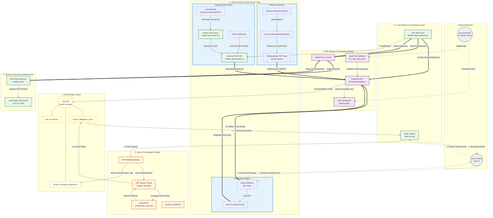

## The Master Architecture Graph

```mermaid
flowchart TD
    %% Global Styling
    classDef client fill:#e3f2fd,stroke:#1565c0,stroke-width:2px;
    classDef daemon fill:#e8f5e9,stroke:#2e7d32,stroke-width:2px;
    classDef core fill:#fff3e0,stroke:#e65100,stroke-width:2px;
    classDef network fill:#f3e5f5,stroke:#6a1b9a,stroke-width:2px;
    classDef storage fill:#fffde7,stroke:#fbc02d,stroke-width:2px;
    classDef external fill:#eceff1,stroke:#455a64,stroke-width:2px;

    %% ----------------------------------------------------
    %% EXTERNAL NETWORKS
    %% ----------------------------------------------------
    subgraph External["External Networks"]
        Drand(("Drand Network\n(Clockless Time)")):::external
        Nostr(("Nostr Relays\n(wss://)")):::external
    end

    %% ----------------------------------------------------
    %% CLIENT LAYER (kinetic-client)
    %% ----------------------------------------------------
    subgraph Clients["1. Client Interfaces (User Entry Points)"]
        direction LR
        
        subgraph ExtClient["Browser Extension"]
            ExtReq["Browser Request (saif.kin)"]
            NetReq["chrome.declarativeNetRequest"]
            WASM["WebAssembly P2P Node\n(kinetic-wasm)"]
            ExtReq -->|Intercepted by| NetReq
            NetReq -->|Redirects to resolve.html| WASM
        end

        subgraph MobClient["Mobile App (Flutter)"]
            MobUI["Flutter WebView\n(kin://saif)"]
            DartFFI["Dart FFI (resolver.dart)"]
            MobUI -->|Calls API| DartFFI
        end

        subgraph DeskClient["Desktop Client (Tauri)"]
            DeskUI["React Dashboard"]
            SplitDNS["OS Split-DNS\n(systemd-resolved/NRPT)"]
            DeskUI -->|"Fetch API (port 16002)"| API
            SplitDNS -->|Intercepts .kin port 53| LocalDNS
        end
    end

    %% ----------------------------------------------------
    %% DAEMON & PROXY LAYER (kinetic-daemon, kinetic-dns)
    %% ----------------------------------------------------
    subgraph LocalDaemonLayer["2. Local Daemon & Interception Layer"]
        direction TB
        LocalDNS["Kinetic DNS Server\n(kinetic-dns-server.rs)"]
        LocalProxy["P2P Web Proxy\n(kinetic-daemon/proxy.rs)"]
        API["Daemon REST API\n(kinetic-daemon/api.rs)"]
        NostrListener["Nostr Listener\n(NIP-04 DM)"]

        LocalDNS -->|Queries for Zone| API
        LocalProxy -->|ProxyRequest| API
    end

    %% ----------------------------------------------------
    %% CORE ENGINE (kinetic-core, kinetic-vdf)
    %% ----------------------------------------------------
    subgraph CoreEngine["3. Math & Cryptography Engine"]
        direction TB
        Mempool["VDF Mempool Queue"]
        VdfWorker["VDF Worker Thread\n(spawn_blocking)"]
        ChiaVDF["chiavdf FFI\n(/tmp/kinetic_vdf.lock)"]
        KeyGen["KeyGen (ed25519)"]

        Mempool -->|Pops VdfJobRequest| VdfWorker
        VdfWorker -->|Evaluates Discriminant| ChiaVDF
        ChiaVDF -->|Returns VdfProof| VdfWorker
    end

    %% ----------------------------------------------------
    %% NETWORK & CONSENSUS LAYER (kinetic-network)
    %% ----------------------------------------------------
    subgraph NetLayer["4. P2P Network & Consensus (libp2p)"]
        direction TB
        DHT["Kademlia DHT\n(KineticRecordStore)"]
        XORTieBreaker["XOR Tie-Breaker\n(drand pulse)"]
        SybilVal["Sybil PoW Validator\n(is_valid_sybil_pow)"]
        P2PTunnel["libp2p Proxy Tunnel"]

        DHT -->|Uses for resolution ties| XORTieBreaker
        SybilVal -->|Validates connecting peers| DHT
    end

    %% ----------------------------------------------------
    %% STORAGE LAYER (kinetic-storage)
    %% ----------------------------------------------------
    subgraph StoreLayer["5. Sled Storage Engine"]
        direction LR
        SledDB[("Sled DB\n(kinetic-storage)")]
        kad_records["kad_record:hex"]
        mempool_backup["kinetic_mempool_persistence"]
        delegation_proof["kinetic_delegation_proof"]
        SledDB --- kad_records
        SledDB --- mempool_backup
        SledDB --- delegation_proof
    end

    %% ----------------------------------------------------
    %% HOST NODE
    %% ----------------------------------------------------
    subgraph HostNode["6. Remote Host Node (Infrastructure)"]
        direction TB
        HostDaemon["Host Proxy Receiver\n(kinetic-host)"]
        TargetWeb["Local Target Web Server\n(127.0.0.1:80)"]

        HostDaemon -->|reqwest HTTP forward| TargetWeb
    end

    %% ----------------------------------------------------
    %% STRUCTURAL PIPELINES
    %% ----------------------------------------------------
    
    %% Drand Sync
    Drand -.->|Broadcast Pulse| XORTieBreaker
    Drand -.->|Validate Age| SybilVal

    %% Client Entry to Backbone P2P Network
    WASM ==>|WebSockets / WebRTC| DHT
    DartFFI ==>|Embedded Rust Node| DHT
    API ==>|Redundant Resolution| DHT

    %% End-to-End Proxy Resolution
    LocalProxy ==>|Lookup HostRoutingRecord| DHT
    LocalProxy ==>|Send ProxyRequest| P2PTunnel
    P2PTunnel ==>|Deliver Request| HostDaemon
    HostDaemon ==>|Return ProxyResponse| P2PTunnel
    P2PTunnel ==>|Deliver Response| LocalProxy

    %% Asynchronous VDF Outsourcing Loop
    MobUI -.->|"1. Encrypt Job Request"| Nostr
    Nostr -.->|"2. Relay to Worker Node"| NostrListener
    NostrListener -->|"3. Push to Queue"| Mempool
    VdfWorker -->|"4. Commit Output"| delegation_proof
    delegation_proof -->|"5. Poll Proof Complete"| NostrListener
    NostrListener -.->|"6. Broadcast Result"| Nostr
    Nostr -.->|"7. Consume Verified Proof"| MobUI
    
    %% Name Verification Flow
    MobUI ==>|"8. Publish Name Reveal"| DHT

    %% Storage Commitments
    DHT -->|Persist Network Zones| SledDB
    Mempool -->|Write Crash Recovery Logs| mempool_backup

    %% Apply Style Layout Clustered Classes
    class ExtClient,MobClient,DeskClient client;
    class LocalDNS,LocalProxy,API,NostrListener daemon;
    class Mempool,VdfWorker,ChiaVDF,KeyGen core;
    class DHT,XORTieBreaker,SybilVal,P2PTunnel network;
    class SledDB,kad_records,mempool_backup,delegation_proof storage;
    class HostDaemon,TargetWeb daemon;
```

---
